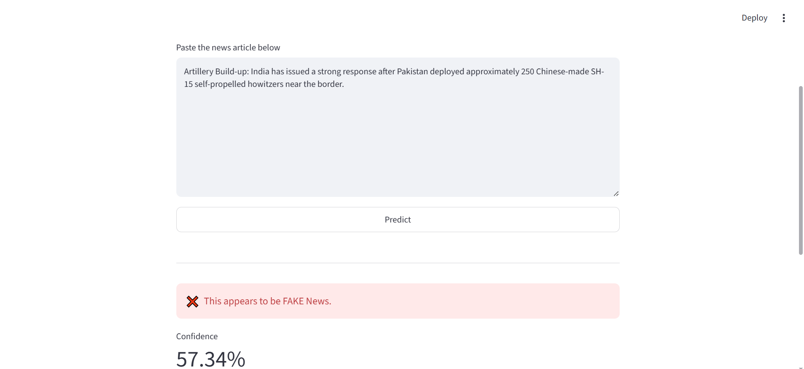
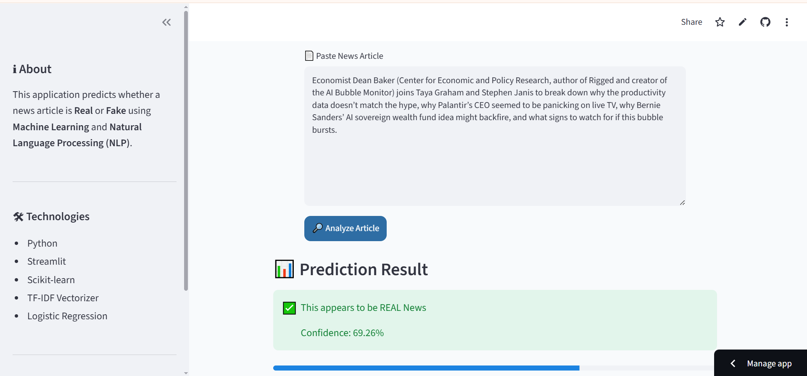
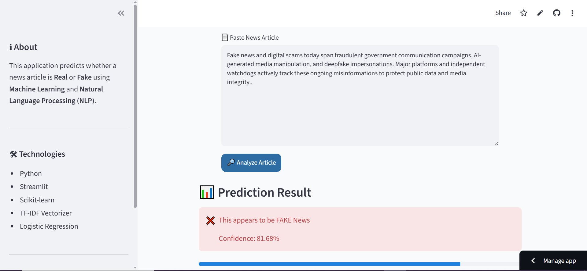

# 📰 Fake News Detection System

A Machine Learning web application that predicts whether a news article is **Real** or **Fake** using Natural Language Processing (NLP) and a trained Logistic Regression model.

---

## 🚀 Features

- Predicts whether a news article is Real or Fake
- Interactive Streamlit web interface
- TF-IDF Vectorization for text processing
- Logistic Regression Machine Learning model
- Displays prediction confidence
- Simple and user-friendly interface

---

## 🛠 Technologies Used

- Python
- Streamlit
- Scikit-learn
- Pandas
- NumPy
- TF-IDF Vectorizer
- Pickle
- Git & GitHub

---

## 📂 Project Structure

```
Fake-News-Detection/
│
├── app.py
├── requirements.txt
├── README.md
├── models/
│   ├── fake_news_model.pkl
│   └── vectorizer.pkl
├── data/
│   ├── Fake.csv
│   └── True.csv
├── screenshots/
│   ├── home.png
│   └── prediction.png
```

---

## 📸 Screenshots

### Home Page


### Prediction



---

## ⚙ Installation

Clone the repository

```bash
git clone https://github.com/charanya22/fake-news-detection.git
```

Move into the project

```bash
cd fake-news-detection
```

Install dependencies

```bash
pip install -r requirements.txt
```

Run the application

```bash
streamlit run app.py
```

---

## 📊 Machine Learning Model

- TF-IDF Vectorizer
- Logistic Regression
- Binary Classification
- Natural Language Processing (NLP)

---

## 📌 Future Improvements

- Deep Learning (LSTM/BERT)
- News URL prediction
- News source verification
- Multi-language support
- Dark Mode

---

## 👩‍💻 Developer

**K. S. Charanya**

B.Tech CSE Student

---

## ⭐ If you like this project, don't forget to star this repository!
## 🚀Live Demo
[Open the Fake News Detection App]https://fake-news-detection-zuxj49kcr7iistfrznvjkq.streamlit.app/
## 📸 Screenshots

### Home Page & Real News Prediction



### Fake News Prediction


